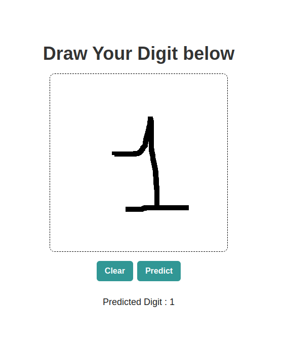

# Digit Classification Web App

This web application allows users to draw a digit and use a pre-trained machine learning model to predict the drawn digit.
Live Demo -> https://sanskarmodi8.github.io/DigitClassification (only frontend will work as server has not been deployed yet)

## Features

- Draw a digit using a drawing canvas.
- Clear the canvas.
- Predict the drawn digit.
- Display the predicted digit.

## Technologies Used

- React for the front-end.
- Flask for the back-end.
- TensorFlow/Keras for the machine learning model.
- Chakra UI for styling.

